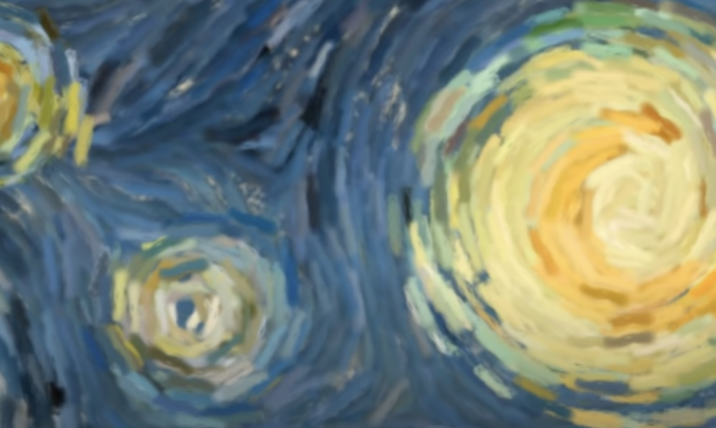
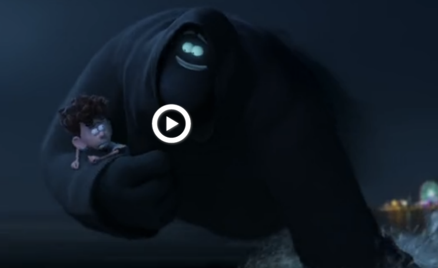

# nzhe0074_9103_Week8

After careful consideration, I decided to choose The Scream as my final project, because it is an amazing masterpiece and techniques required to dynamize the picture seem quite challenging.

## Inspriation ##

### 1. The first technique. ###

The first inspiration I got is from *Starry Night*(pvrellis). The author changed the originally static starry sky into a dynamic effect, making the whole picture vivid. Thus, using the same technique to make the sky in The Scream vivid might be a good idea.

### 2. The Second technique. ###

The second inspiration is from a movie I watched recently which name is  *Orion and the Dark*. When the Dark runs away, he carries the boy with a smog trail. Then I struck upon the idea that this smog trail could be used on the person screaming in The Scream.

## How to realize these rechniques ##

### 1. The first technique ###

To achieve the first effect, I found this code on OpenProcessing which is used to realize a dynamic sky in The Scream.

> *[Click Me](https://openprocessing.org/sketch/1890784) to check the coding of how to realize dynamic sky.*

### 2. The second technique. ###

To achieve the second effect, I found a similar effect form P5.js which might be helpful.

>*[Click Me](https://happycoding.io/tutorials/p5js/animation/ghost) to check the coding of how to realize floating sky.*

